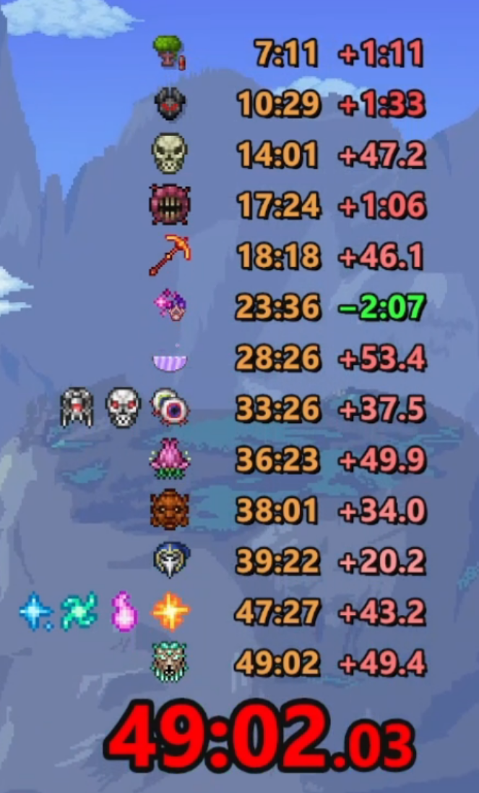

# TerrariaSplit

  

  English ·
  <a href="README.md">简体中文</a>

TerrariaSplit is a Windows split timer for Terraria. It is built around boss-route timing, and also supports item, NPC, biome, and other conditions. It provides a visual settings UI, real-time overlay, statistics, and automation tools for practice and world generation.

Currently supports Terraria `1.4.5.6` and `1.4.4.9`.

## Core Features

### Timing And Routes

- Supports multiple condition types: boss defeats, item pickups, NPC arrivals, and biome entry.
- Supports multi-target conditions such as "all completed", "any completed", and "at least N completed".
- Supports custom groups, including main groups, attached groups, and their display conditions.

### Display

- Supports mouse passthrough and a compact RTSS OSD for fullscreen Terraria.
- Supports configuring the main UI font, icons, opacity, colors, shadows, and outlines.
- Supports icon lighting, current-stage highlighting, font color gradients, boss defeat animations, and segment highlight animations.

### Data And Statistics

- Records run data automatically and can optionally update personal bests.
- The statistics page can compare current results, historical results, personal bests, and reference times.

### Automation Tools

- Creates worlds with one action, including special and secret seeds, and loads practice saves.
- Supports pyramid filtering, item filtering, and Zenith auto star catch.

## Notes

- This project was primarily built with AI assistance.

## OBS Capture Black Background

If OBS window capture shows a black background, try using the Windows 10 capture method instead of the traditional window capture method.

## Acknowledgements

- Thanks to [LiveSplit](https://github.com/LiveSplit/LiveSplit) for inspiring the speedrun timer layout and split display style.
- Boss icon lighting and presentation were inspired by [kengho/terraria-boss-checklist](https://github.com/kengho/terraria-boss-checklist).

## License

This project is licensed under the MIT License.
