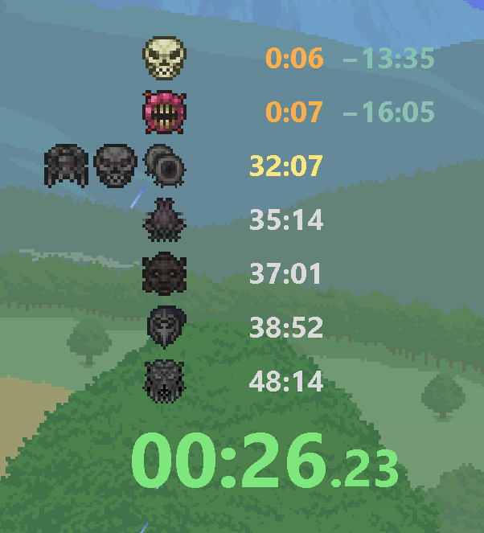
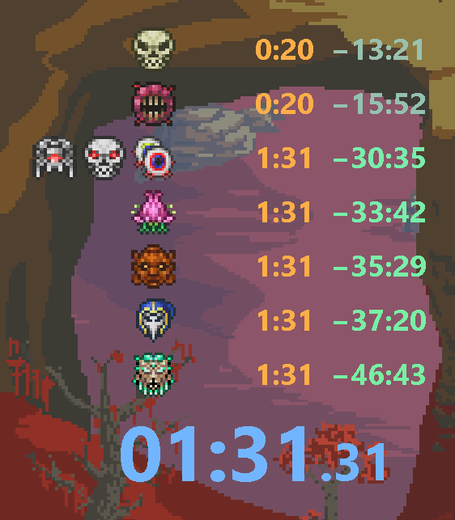
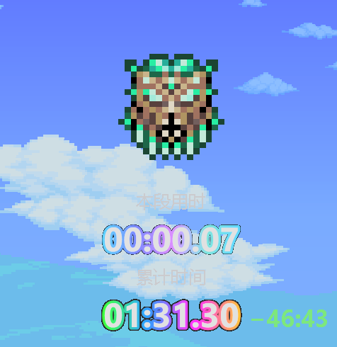
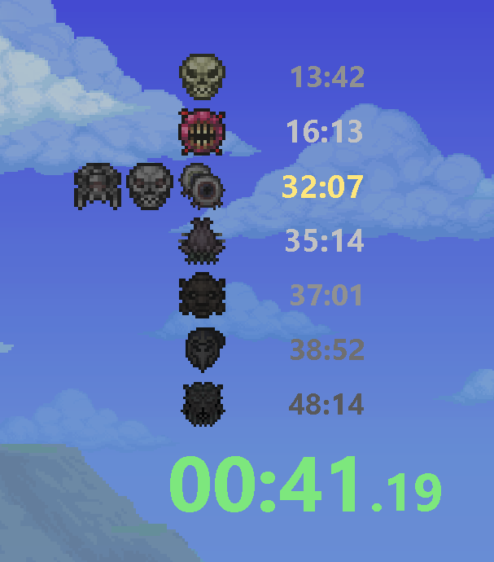

# TerrariaSplit

<p align="center">
  <span>English</span> ·
  <a href="README.md">简体中文</a>
</p>

 TerrariaSplit is a highly customizable BOSS-only timer for 1.4.5 with polished split animations, flexible reference data, statistics comparison, and a full visual settings UI. 

## Features

### ⚡ Convenience

TerrariaSplit aims to feel ready the moment it opens. Startup is fast, the main overlay stays lightweight, and most common settings can be changed through a visual configuration window instead of repeatedly editing JSON by hand.

### 🧩 Freedom

You can shape the timer around your own route and overlay style:

- Fully customize BOSS order, enabled states, grouping, and icons.
- Maintain multiple configurations and switch them from the main window context menu.
- Adjust the position, size, font, and visibility of split display and main timer components.
- Customize UI colors to match your stream or recording layout.
- Configure sound effects for pause, reset, and split events.

### 📊 Practicality

TerrariaSplit automatically records run data and can optionally update personal best data. The statistics view makes it easy to compare your current or historical results against personal bests and reference times, helping you identify which BOSS or segment needs work.

Practice runs that do not start from Skeletron are ignored automatically, so mid-run practice does not accidentally pollute personal best data.

### ✨ Visual Polish

TerrariaSplit focuses on visual feedback as much as raw timing:

- BOSS icons light up progressively according to the route.
- BOSS defeats trigger a polished completion animation with centered segment and split times.
- Strong segment or overall results can use highlighted, neon, aurora, and rainbow-style text effects.
- The current stage can be emphasized so your eye naturally lands on the active split.

## Preview

### Main Window

<p align="center">
  
</p>

<p align="center">
  
</p>

### BOSS Defeat Animation and Highlighted Text

<p align="center">
  
</p>

### Current Stage Highlight

<p align="center">
  
</p>

## Default Hotkeys

| Action | Default key |
| --- | --- |
| Pause / Resume | `F5` |
| Reset at menu | `F6` |
| Mouse passthrough | `F10` |

## Configuration Files

TerrariaSplit stores configuration under the application directory:

```text
TerrariaSplit.exe
settings/
  settings.json
  other-profile.json
  active-profile.txt
reference-times/
  WR.json
last-times/
  2026-05-02-...json
```

- `settings/*.json`: main configuration profiles.
- `settings/active-profile.txt`: the currently selected profile name.
- `reference-times/*.json`: reference time sets.
- `last-times/*.json`: automatically recorded run history.

On first launch, if no valid configuration exists under `settings/`, TerrariaSplit generates one from the bundled default template.

## Notes

- The project depends on Terraria memory layout for the currently supported game version. Game updates may require rework.
- Sound effects currently use `.wav` files.
- Configuration files are plain JSON. Manual editing is supported, but keeping a backup is recommended.
- If OBS Window Capture shows a black background, set the capture-visible key color in `Settings > Colors > UI Colors > Capture background`, for example `#FF00FF` or `#00FF00`, then key that color out in OBS. The app window itself stays transparent.

## Acknowledgements

- Thanks to [LiveSplit](https://github.com/LiveSplit/LiveSplit) for long-standing inspiration around speedrun timer interactions, layouts, and split presentation.
- The BOSS lighting design and icon presentation were referenced from [kengho/terraria-boss-checklist](https://github.com/kengho/terraria-boss-checklist); TerrariaSplit reimplements the progress feedback in its own timer UI.
- This project was built primarily with AI assistance, including requirement organization, implementation, UI copy, and documentation. Final design decisions, testing, and release responsibility remain with the maintainer.

## Privacy and Local Data

TerrariaSplit does not include online sync, account login, or remote telemetry. It reads local Terraria process state and stores configuration, reference times, and run history locally next to the application.

Main local data paths:

- `settings/`: configuration files.
- `reference-times/`: reference times.
- `last-times/`: run history.
- `terrariasplit.log`: runtime error log.

Before publishing the repository or release archives, check these files for personal paths, sound file paths, or run history you do not want to share.

## Copyright and Asset Risks

The project code is released under the MIT License. The project name, game name, BOSS names, and any icon assets may be related to Terraria and its rights holders. This is not an official Re-Logic or Terraria project.

If you distribute a build containing assets from other projects or original/modified Terraria icons, preserve the corresponding license and copyright notices and verify the source and license of those assets. A safer approach is to use self-made, licensed, or user-provided local icons.

## License

This project is licensed under the MIT License. See [LICENSE](LICENSE).
