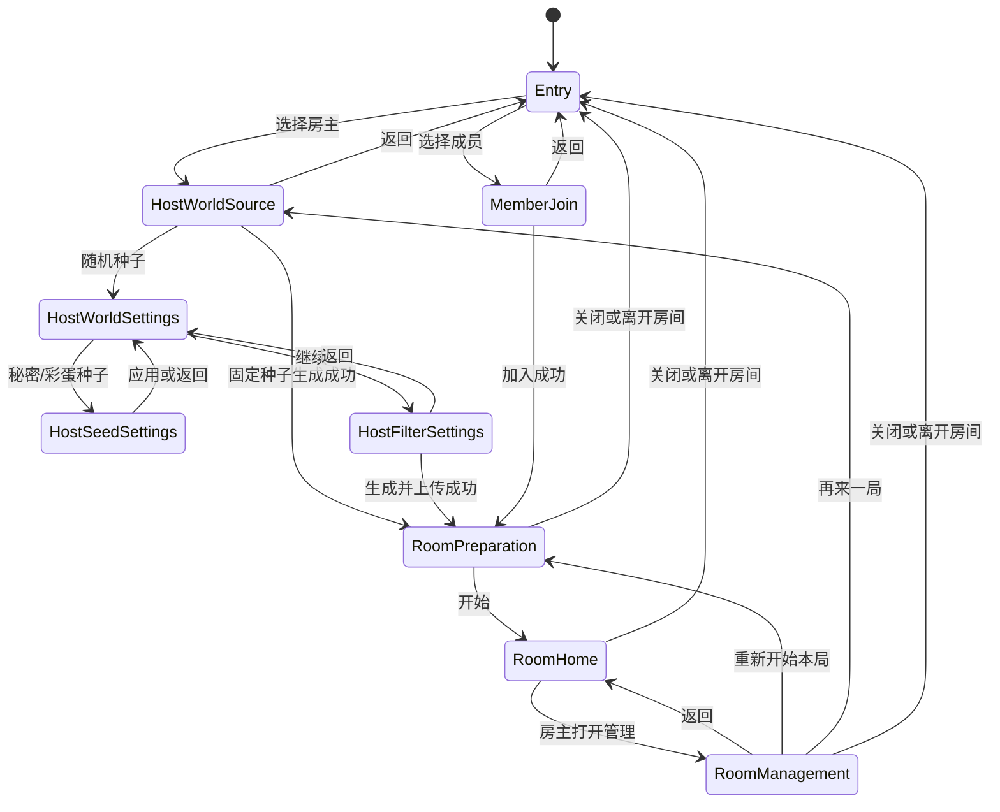

# Terraria Race 页面状态

页面导航只由 `RaceInGameTransition` 改变；生成、加入、重开等异步操作是覆盖当前页面的操作态，不是独立导航来源。

```mermaid
stateDiagram-v2
    [*] --> Entry
    Entry --> HostWorldSource: 选择房主
    Entry --> MemberJoin: 选择成员
    MemberJoin --> Entry: 返回
    HostWorldSource --> Entry: 返回
    HostWorldSource --> HostWorldSettings: 随机种子
    HostWorldSource --> RoomPreparation: 固定种子生成成功
    HostWorldSettings --> HostSeedSettings: 秘密/彩蛋种子
    HostSeedSettings --> HostWorldSettings: 应用或返回
    HostWorldSettings --> HostFilterSettings: 继续
    HostFilterSettings --> HostWorldSettings: 返回
    HostFilterSettings --> RoomPreparation: 生成并上传成功
    MemberJoin --> RoomPreparation: 加入成功
    RoomPreparation --> RoomHome: 开始
    RoomHome --> RoomManagement: 房主打开管理
    RoomManagement --> RoomHome: 返回
    RoomManagement --> RoomPreparation: 重新开始本局
    RoomManagement --> HostWorldSource: 再来一局
    RoomPreparation --> Entry: 关闭或离开房间
    RoomHome --> Entry: 关闭或离开房间
    RoomManagement --> Entry: 关闭或离开房间
```

房间状态由服务器会话决定。只要存在未关闭房间，重新打开页面会恢复到房间主页；重开本地包时，关闭或离开会先取消并等待重开任务，再解除世界锁，避免目录绑定与解绑并发。
